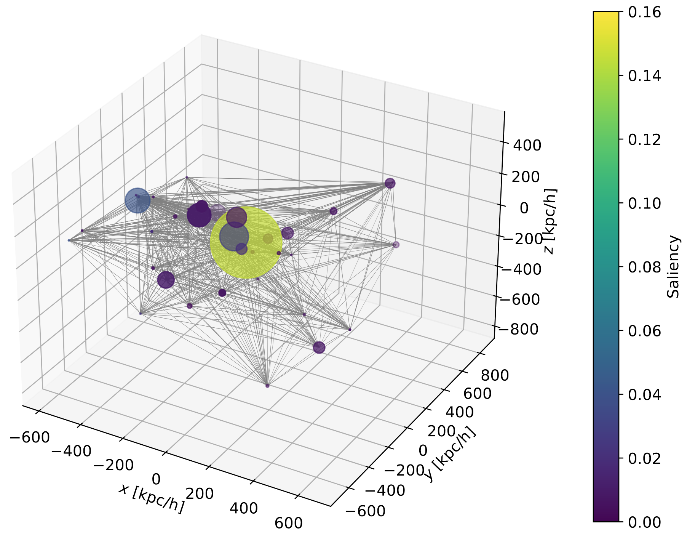

# HaloGraphNet

 

Predict halo masses from simulations via Graph Neural Networks.

Given a dark matter halo and its galaxies, creates a graph with information about the 3D position, stellar mass and other properties. Then, it trains a Graph Neural Network to predict the mass of the host halo. Data are taken from the [CAMELS](https://camels.readthedocs.io/en/latest/index.html) hydrodynamic simulations, specially suited for Machine Learning purposes. Neural nets architectures are defined making use of the package [PyTorch-geometric](https://pytorch-geometric.readthedocs.io/en/latest/).

See the papers [arXiv:2111.xxxx](https://arxiv.org/abs/2111.xxxx) for more details.

IN DEVELOPMENT

## Scripts

Here is a brief description of the codes included:

- `main.py`: main driver to train and test the network.

- `params.py`: list of default hyperparameters, to be modified by the user.

- `onlytest.py`: tests a pre-trained model.

- `hyperparams_optimization.py`: optimize the hyperparameters using optuna.

- `plotcorrelations.py`: plot several features of the CAMELS data.

- `captumtest.py`: studies interpretability of the model.

- `halomass.py`: using models trained in CAMELS, predicts the mass of real halos, such as the Milky Way and Andromeda.

- `visualize_graphs.py`: display several halos as graphs.

In the folder `Source`, several auxiliary routines are defined:

* `constants.py`: basic constants and initialization.

* `load_data.py`: contains routines to load data from simulation files.

* `plotting.py`: includes functions for displaying the results.

* `networks.py`: includes the definition of the networks architectures.

* `training.py`: includes routines for training the net.

* `galaxies.py`: contains data for real galaxies MW and M31.

## Requisites

The libraries required for training the models and compute some statistics are:
* numpy
* pytorch-geometric
* matplotlib
* scipy
* sklearn
* optuna (only for optimization in `hyperparams_optimization.py`)
* astropy (only for MW and M31 data in `Source/galaxies.py`)
* captum  (only for `captumtest.py`)

## Usage

These are some advices to employ the scripts described above:
1. To perform a search of the optimal hyperparameters, run `hyperparams_optimization.py`.
2. To train a model with a given set of parameters defined in `params.py`, run `main.py`.
3. Once a model is trained, run `onlytest.py` to test in the training simulation suite and in the other one included in CAMELS (IllustrisTNG and SIMBA).
4. Run `captumtest.py` to study the interpretability of the models, feature importance and saliency graph.
5. Run `halomass.py` to infer the mass of the Milky Way and Andromeda, whose data are defined in `Source/galaxies.py`.

## Citation

If you use the code, please link this repository, and cite [arXiv:2111.xxxx](https://arxiv.org/abs/2111.xxxx) and the DOI [10.5281/zenodo.xxxx](https://doi.org/10.5281/zenodo.xxxx).

## Contact

For comments, questions etc. you can contact me at <pablo.villanueva.domingo@gmail.com>.
